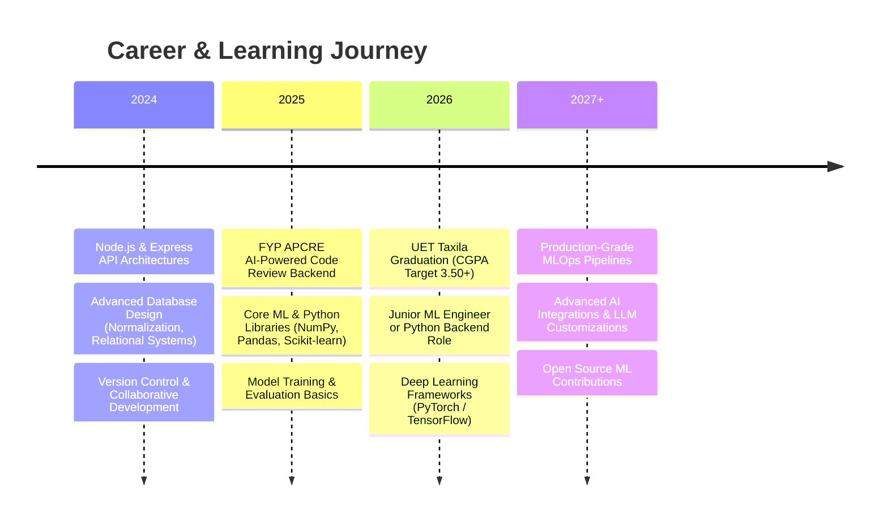

 

### 🌟 Bridging Backend Systems & Intelligent Machine Learning 🌟
*Building automated, data-driven, and high-performance AI-assisted software applications*

 

  
  
  
  
  

 

## 👨‍💻 About Me

🚀 *Software Engineer* | *Backend Architect* | *Future ML Engineer*

Currently pursuing a *B.Sc. in Software Engineering* at *UET Taxila* (CGPA: **3.49/4.00**, expected 2026), specializing in:

🤖  Machine Learning & Intelligent Systems  
⚙️  Robust Backend Frameworks (Node.js, Express)  
🗄️  Advanced Database Design & Relational Modeling (Oracle SQL)  
🧩  AI-Powered Software Tools & Code Engines  
⚡  Performant Code Optimization & Quality Assurance  

 

*🎯 Mission:* To architect clean, performant, and self-optimizing backend software integrated with machine learning models that solve complex real-world data problems.

 

## 💼 Core Expertise

<table>
<tr>
<td width="50%" valign="top">

<h3 align="center">🧠 Machine Learning & AI</h3>

*Machine Learning & Data Analysis*
- Automated code analysis & bug detection logic
- Workflows for model feedback loops
- Data preprocessing & preparation
- Familiarity with core Python data science libraries (NumPy, Pandas)
- Designing system architectures for AI engines

*Research & Logic Design*
- Automated logic evaluation
- Code parser design
- Abstract Syntax Trees (AST) structure mappings

</td>
<td width="50%" valign="top">

<h3 align="center">⚙️ Software & Backend Engineering</h3>

*Backend Systems*
- Node.js & Express.js server architectures
- RESTful API design & development
- Systems integration and module connectivity

*Database Management Systems*
- Schema Design & Relational Modeling
- Database Normalization (1NF, 2NF, 3NF, BCNF)
- SQL Query Optimization & Tuning
- Oracle Database Administration & JDBC Integration

*Desktop Application Development*
- JavaFX Application Design & Controller logic
- UI/UX layout management with Scene Builder

</td>
</tr>
</table>

## 🚀 Featured Projects

### 🏆 *AI & Database-Driven Applications*

<table>
<tr>
<td width="50%" valign="top">

<h3 align="center">🔍 APCRE (Final Year Project)</h3>

*AI-Powered Code Review Engine*

Contributed as a **Backend Engineer** to develop an automated code analysis engine for Python source code review.

*Key Achievements:*
- ✅ Developed logic for automated bug detection & workflow generation.
- ✅ Designed system components that generate detailed reviewer feedback.
- ✅ Structured system integration pipelines between AI modules and backend services.

*Tech:* Python, AI Models, System Workflows, Git

</td>
<td width="50%" valign="top">

<h3 align="center">🏫 School Management System</h3>

*Relational Database Design & Desktop Client*

Engineered the database schema and application code for a robust management platform.

*Key Achievements:*
- ✅ Designed normalized Oracle schema avoiding redunancies.
- ✅ Implemented relational tables, referential integrity constraints, and SQL logic.
- ✅ Connected schema to a modular JavaFX frontend via JDBC for real-time operations.

*Tech:* Java, JavaFX, JDBC, Oracle Database, SQL

</td>
</tr>
</table>

## 🛠️ Tech Stack

### 💻 Programming Languages & Backend

### 🗄️ Database Management Systems

### 🔧 Developer Tools & Platforms

## 🎓 Education & Achievements

<table>
<tr>
<td width="30%" align="center">

</td>
<td width="70%" valign="top">

### 🎓 BS in Software Engineering
*University of Engineering & Technology (UET) Taxila, Pakistan*  
**Expected Graduation: 2026** | **Current CGPA: 3.49 / 4.00**

---

### 🏆 Key Academic & National Milestones
* **Batch Topper** | F.Sc (Pre-Engineering) at Uswa College Islamabad (1077 / 1100).
* **Top 12% National Percentile (88.1%)** | HEC Pakistan National Skill Competency Test (NSCT).
* **Matriculation Scholar** | Uswa College Islamabad (1048 / 1100).

</td>
</tr>
</table>

## 📊 GitHub Analytics

## 🎯 Career Roadmap (AI & ML Focus)

 

<table>
<tr>
<td width="33%" valign="top">

### 📍 Current Focus
* ✅ Python Backend & AI Workflows  
* ✅ Machine Learning Foundations  
* ✅ Finalizing FYP Code Reviews  
* ✅ Relational Schema Engineering  
* ✅ Academic Excellence (CGPA 3.49)  

</td>
<td width="33%" valign="top">

### 🚀 2025 Goals
* 🎯 Mastering Python Data Libraries  
* 🎯 Developing Custom ML Models  
* 🎯 Integrating AI APIs into Backends  
* 🎯 Open Source Git Collaborations  
* 🎯 Building high-speed APIs  

</td>
<td width="33%" valign="top">

### 🌟 Long-Term Vision
* 💫 MLOps Systems Engineer  
* 💫 Deep Learning Architect  
* 💫 Robust AI-assisted Platforms  
* 💫 Graduate Studies in Data Science  
* 💫 Tech Leadership in AI Systems  

</td>
</tr>
</table>

## 🤝 Open for Collaboration

### 🌟 Let's Build Something Intelligent Together! 🌟

I am looking to collaborate on:

<table>
<tr>
<td align="center" width="33%">

*Database Design*

Normalization Audits  
SQL Query Optimization  
Relational Schema Architecting

</td>
<td align="center" width="33%">

*Backend Integrations*

Node.js REST Services  
Express API Structures  
System Interoperability

</td>
<td align="center" width="33%">

*Machine Learning / AI*

AI-Powered Software Workflows  
Python Model Integrations  
Algorithmic Bug Reviews

</td>
</tr>
</table>

*📬 Have an interesting project idea or want to talk Machine Learning? Get in touch!*

## 📞 Connect with Me

  

### 💬 Let's chat about:
*🔹 Software Backend Systems* | *🔹 Database Relational Modeling* | *🔹 Machine Learning & AI* | *🔹 Project Collaborations*

 

*© 2026 Ammar Haider | UET Taxila | Software Engineering*

